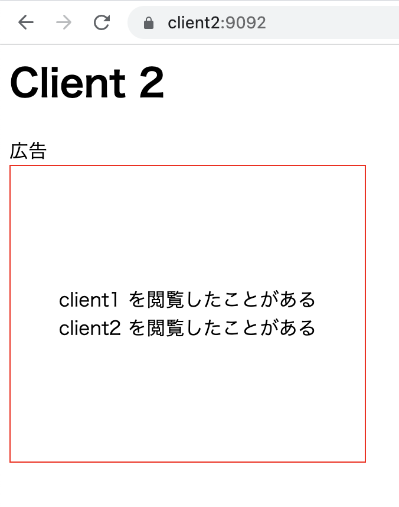

# 3rd-party-cookie

3rd party Cookie を用いてトラッキングするサンプルです

## 準備

- ホスト名 `client1` `client2` `tracker` が 127.0.0.1 に向くように hosts をいじる
- mkcert 等を利用して以下の鍵を作成する

| 配置                          | 説明             |
| ----------------------------- | ---------------- |
| `client1/ssl/client1.pem`     | client1 の証明書 |
| `client1/ssl/client1-key.pem` | client1 の秘密鍵 |
| `client2/ssl/client2.pem`     | client2 の証明書 |
| `client2/ssl/client2-key.pem` | client2 の秘密鍵 |
| `tracker/ssl/tracker.pem`     | tracker の証明書 |
| `client1/ssl/tracker-key.pem` | tracker の秘密鍵 |

## 検証

1. `make build` を実行し Docker イメージをビルド
2. `make up` を実行し環境を立ち上げる
3. https://client1:9091/ にアクセスする。 **client1** にアクセスしたことが記録されている
   
4. https://client2:9092/ にアクセスする。 **client1** にアクセスしたことが **client2** に表示される広告サーバーに記録されていることがわかる
   
5. 再び https://client1:9091/ にアクセスする。手順 3 のときと比べて **client2** にアクセスしたことが **client1** に表示される広告サーバーに追加で記録されていることがわかる
   
